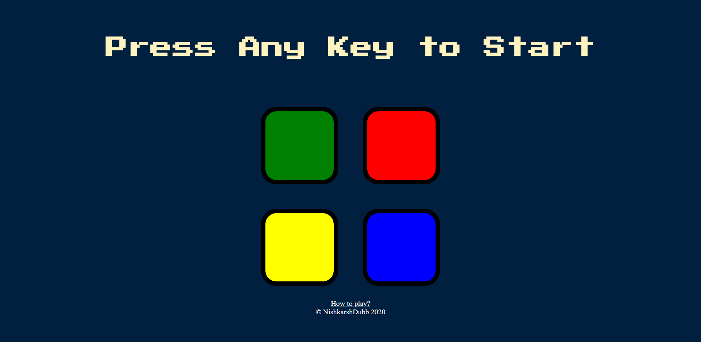
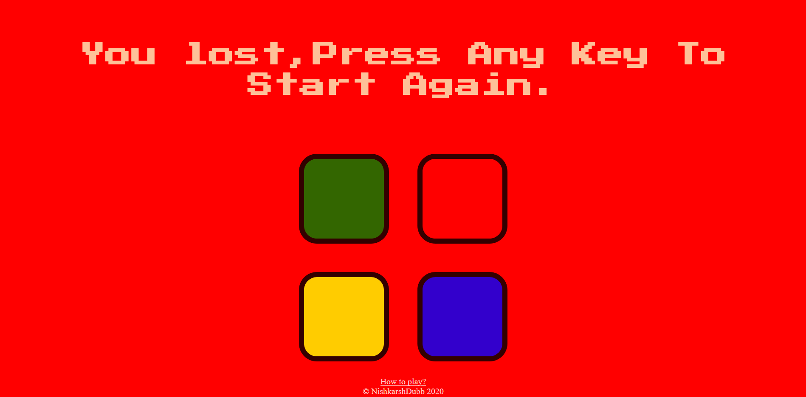

# Simon-Game-Project-jQuery-
Simon was an electronic game of memory skill invented by Ralph H. Baer and Howard J. Morrison.This game uses the same logic of that electronic game and has been developed using Javascript and Jquery.

## How to play?

There are four colored buttons, each producing a particular tone when it is pressed or activated. A round in the game consists of the bot lighting up one random button, after which the player must reproduce that same order/sequence by pressing the buttons. As the game progresses,it get tougher to remember the sequence. In order to move forward in the game the player must press all the buttons in the same sequence as they were pressed by the bot.

## Author 
> Nishkarsh01

## Screenshots 📷

## Live Demo 

 [https://nishkarsh01.github.io/Simon-Game-Project-jQuery-/](https://nishkarsh01.github.io/Simon-Game-Project-jQuery-/)

## Developed Using 💻

+ [Html](https://developer.mozilla.org/en-US/docs/Web/HTML)
+ [Css](https://developer.mozilla.org/en-US/docs/Web/CSS)
+ [Javascript](https://developer.mozilla.org/en-US/docs/Web/javascript)
+ [jQuery](https://jquery.com/)

## Installation or Getting Started

Run the following command in the terminal:

	git clone https://github.com/Nishkarsh01/Simon-Game-Project-jQuery-.git
or download the zip file from github.
    

## Usage
After extracting the files,

    cd Simon-Game-Project-jQuery-
    and simply, open the index.html file

## Collaborate
To collaborate, reach me on [nishdubb11@gmail.com]()

## Further help/Reference

+ [MDN Web Docs](https://developer.mozilla.org/en-US/)
+ [w3schools.com](https://www.w3schools.com/)
+ [jquery.com/](https://jquery.com/)
    

